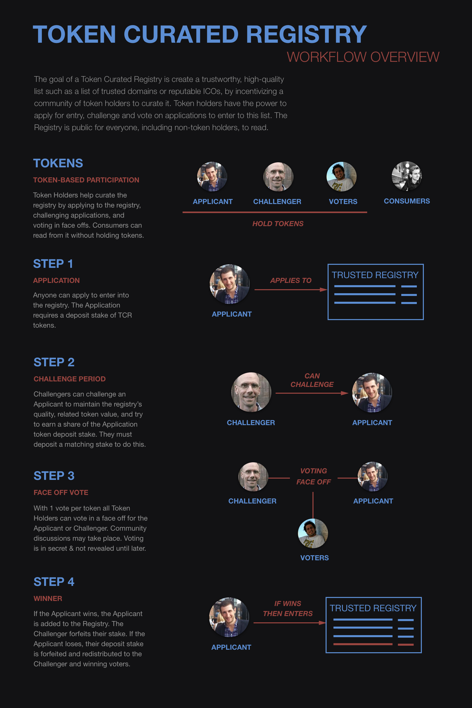
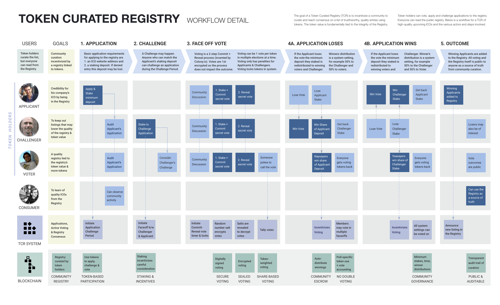

# Token-Curated Registry

[ ](https://app.codeship.com/projects/257003)

A string-keyed [token-curated registry (TCR)](https://medium.com/@ilovebagels/token-curated-registries-1-0-61a232f8dac7).

## Initialize
The only environmental dependency you need is Node. Presently we can guarantee this all works with Node 8.
```
npm install
npm run compile
```

## Tests
The repo has a comprehensive test suite. You can run it with `npm run test`. To run the tests with the RPC logs, use `npm run test gas`.

## Composition of the repo
The repo is composed as a Truffle project, and is largely idiomatic to Truffle's conventions. The tests are in the `test` directory, the contracts are in the `contracts` directory and the migrations (deployment scripts) are in the `migrations` directory. Furthermore there is a `conf` directory containing json files where deployments can be parameterized.

In both the `contracts` and `conf` directories are subdirectories named `optional`. These contain contracts for a token sale and parameters for that sale, respectively. When deploying to any network other than `mainnet`, the migration script `2_optional_for_test.js` will execute along with special logic in `3_deploy_contracts.js` to deploy a sale and disburse tokens to actors specified in the `optional` subdirectory of the `config` folder. This is relied on by the test scripts and may be useful for deploying test instances on networks like Rinkeby and pre-seeding specified accounts with registry tokens. When deploying to mainnet, a pre-deployed token address should be specified in the main `config.json`. The built-in token sale code should not be used to run a real token sale, and we make no guarantees for its suitability to the purpose.

### Local contracts
`Registry.sol`, `Parameterizer.sol` and `Challenge.sol` are the repo's local contracts. `Challenge.sol` is a library for challenge logic used by both the registry and the parameterizer.

### Packages
The repo consumes several EPM packages. `dll` and `attrstore` are libraries used in the TCR's doubly-linked list abstraction. `tokens` and `plcr` are stateful contracts. `tokens` provides an ERC20-comaptible token implementation. `plcr` is the token-voting system used for challenge resolution in both the registry and the parameterizer. All packages are installed automatically when running `npm run compile`.

### Workflow diagram



